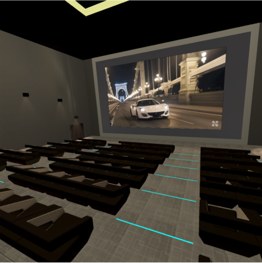
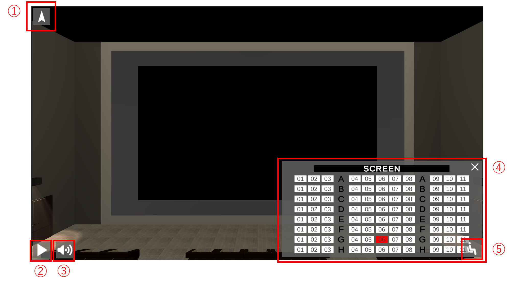
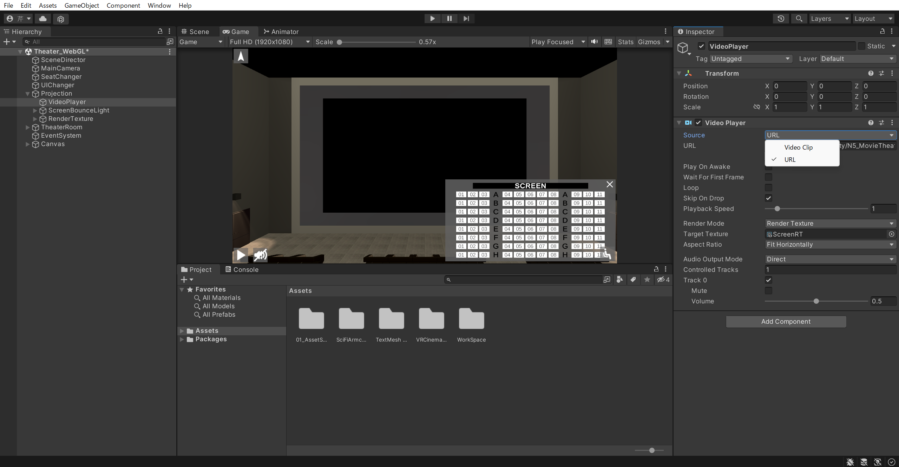

# Unity-MovieTheater-WebGL
In this Unity3D project, a movie theater is created. webGL is selected as the build target.
  

  

 

## 概要
本Unity ProjectはWebGLをbuild targetとした映画館です．もともとVR空間における映画館であったものをWebブラウザ上でも楽しめるようにスクリプト改変等を行いました．自作の映像さえ用意できれば，オリジナル映像を放映する映画館を誰でも作ることができます．なお，映像のプロジェクション機能は[VR Cinema for Mobile](https://assetstore.unity.com/packages/3d/props/interior/vr-cinema-for-mobile-150120)に含まれるアセットを用いました．
  

## インタフェース構成及び操作方法
初めに映画館のインタフェースの画像を示します．
  

 

**① 角度表示UI**

ユーザの向きはカーソルキーにより変更可能です．カーソルキーでユーザの向きを変更すると，ユーザのy軸方向の回転に伴ってこちらのUIの矢印方向が回転します．向きを正面に戻したい（初期状態にリセットしたい）場合，こちらのUIをクリックすることで向きがリセットされ，z軸正の方向を向くようになります．

**② 映像再生UI**

こちらのボタンをクリックして頂くと，映画館での上映がスタートします．はじめは天井のライトが徐々に暗くなり，次に側面壁のライトが徐々に暗くなり，というように映画館の雰囲気を味わうことが可能です．なお，一時停止機能はつけていないため，再生を始めると映像終了まで自動的にフローが進行します．

**③ 音量設定UI**

こちらのボタンをクリックして頂くと，映画館で放映される映像の音量のOn/Offが設定できます．初期状態は先ほど示したスクリーンショットのような状態で，一度クリックするとUIが変わりミュート状態になります．なお，音量はOn/Offのバイナリ設定です．

**④ 座席設定UI**

こちらのUIでは，ユーザの座席位置を確認及び変更することができます．現在ユーザが座っているシート(G-06)は赤色で表示されるように設定されており，ほかの座席をクリックすることで座席移動することが可能です．なおこちらのUIはサイズが大きいため，右上の✕ボタン（④の左隣のボタン）をクリックすることでUIを最小化することが可能です．

**⑤ 座席表示UI**

こちらのUIは④の座席設定UIが最小化された際に表示されるUIです．そのため，④とこちらの⑤のUIはいずれか一方のみが画面上に表示されることになります．こちらのUIをクリックすると④の座席設定UIが表示され，ユーザの座席位置の確認及び変更が可能となります．
  

## Unity Projectの利用について
本リポジトリのUnityProjectのEditor Versionは2021.3.9f1です．またWebGLでBuildした際の動画の指定方法について注意点があります．

> [!Note]
> Projection > VideoPlayer には Video Player Component がアタッチされており，こちらで上映する映像を指定することができます．Video Player Component での映像の指定方法には，Video Clip（Unity でのアウトレット接続）と URL、二つの方法があります．しかし，WebGL に対応する映像の指定方法は URL のみです．そのため，WebGL で上映したい映像がある場合は映像をサーバーにアップロードしてから URL での指定をお願いいたします．

 

 

また，MainSceneはWorkSpace > Sceneの階層にあります．
  
